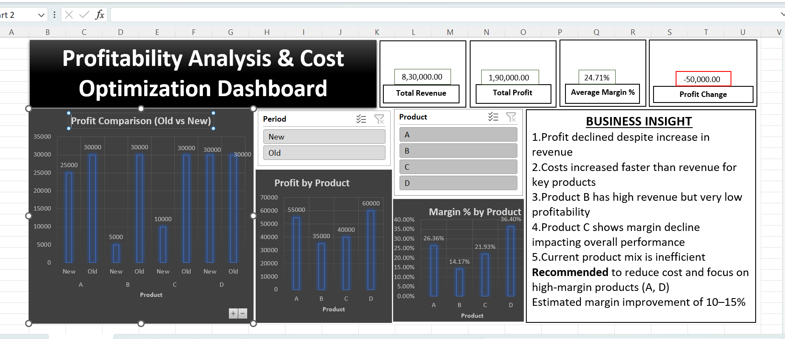

# 📊 Cost Optimization & Profitability Analysis (FP&A)

---

## 🔍 Objective
Analyze profit decline and identify key drivers such as cost escalation and product mix inefficiencies.

---

## 📌 Key Findings
- Profit declined despite increase in revenue  
- Costs increased faster than revenue for key products  
- Product B has high revenue but very low profitability  
- Product C shows margin decline impacting overall performance  

---

## 🧠 Analysis
- Cost escalation is the primary driver of margin pressure  
- High-revenue low-margin products are diluting overall profitability  
- Current product mix is inefficient  

---

## 🎯 Recommendations
- Reduce cost for Product B and C  
- Focus on high-margin products (A, D)  
- Optimize product mix  

---

## 📈 Impact
Estimated margin improvement of 10–15% through cost optimization and mix correction
